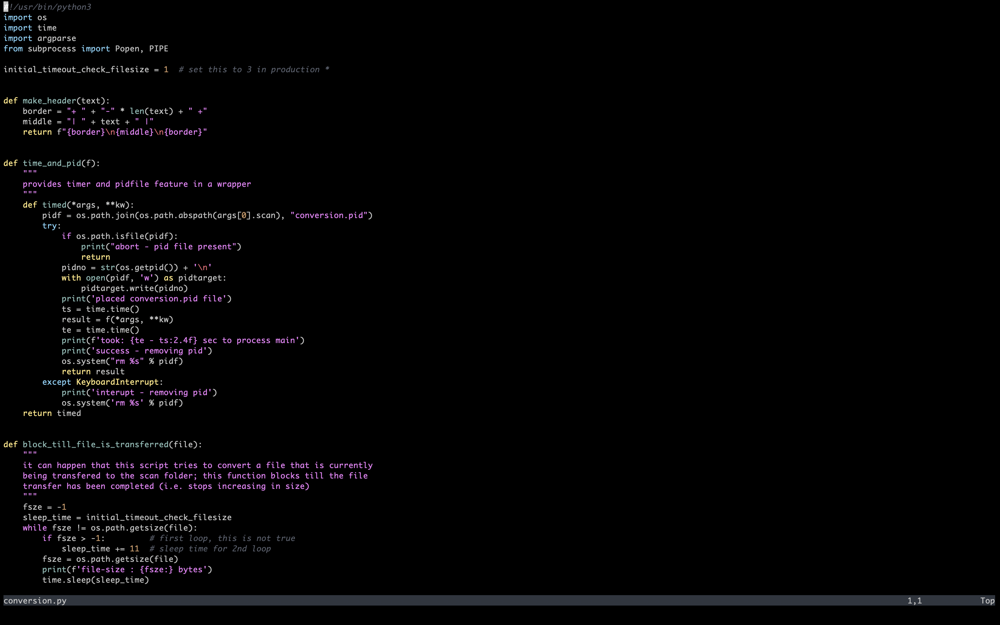

# space-terminal

## screenshot

## notes

clone manually:

    cd ~/.local/share/nvim/plugged
    git clone git@github.com:michaelfresco/space-terminal.nvim.git

add to vim-plug:

    " vim-plug
    Plug 'michaelfresco/space-terminal.nvim'

config (classic):

    let g:spaceterminal_config = {
        \ 'style': 'default',
    \}
    colorscheme spaceterminal

## reference

- [onedark.nvim](https://github.com/navarasu/onedark.nvim)
