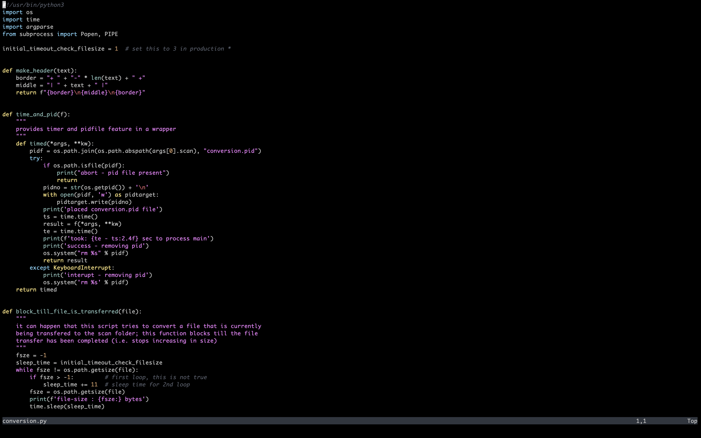

# space-terminal

## screenshot

## notes

install:

    " vim-plug
    Plug 'michaelfresco/space-terminal.nvim'

    --- packer
    use 'michaelfresco/space-terminal.nvim'

config (classic):

    let g:spaceterminal_config = {
        \ 'style': 'default',
    \}
    colorscheme spaceterminal

config (lua):

    require('spec-terminal').setup {
        style = 'default'
    }
    require('spec-terminal').load()

## reference

- [onedark.nvim](https://github.com/navarasu/onedark.nvim)
