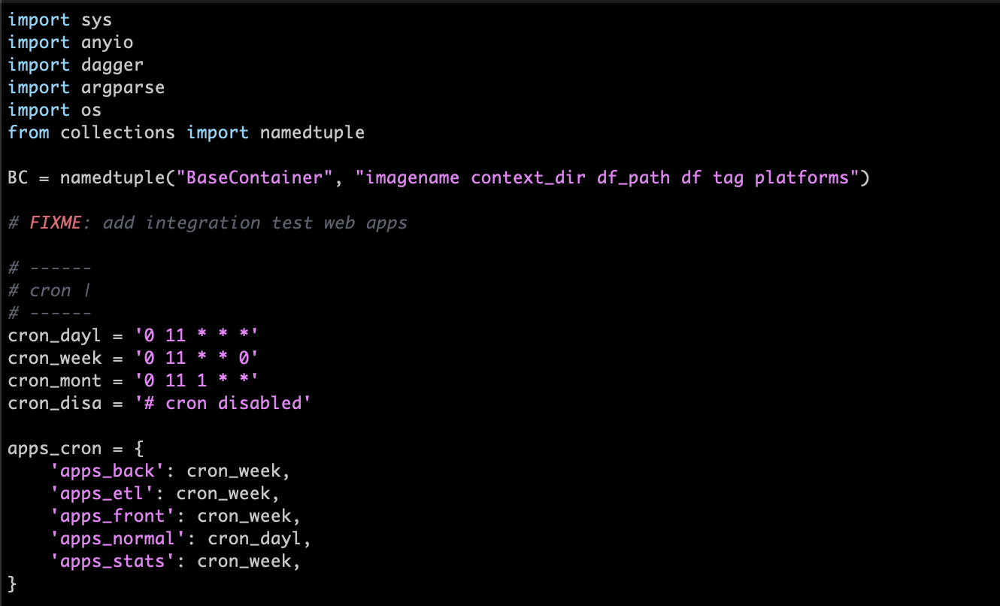

# space-terminal

## screenshot

## notes

clone manually:

    cd ~/.local/share/nvim/plugged
    git clone git@github.com:michaelfresco/space-terminal.nvim.git

add to vim-plug:

    " vim-plug
    Plug 'michaelfresco/space-terminal.nvim'

config vim:

    colorscheme spaceterminal

config lua:

    require('spaceterminal').load()

## reference

- [onedark.nvim](https://github.com/navarasu/onedark.nvim)
